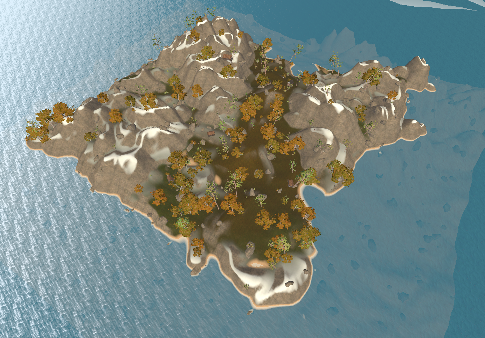

# AIsland, The procedurally generated island
AIsland is a game in which the player awakens on a procedurally generated island with the main goal of finding a boat to be able to escape. A new unique island is generated every time the player starts the game. The player can trek across multiple biomes with different types of terrain and find interesting landscapes during the search for the boat. 
### Preview

